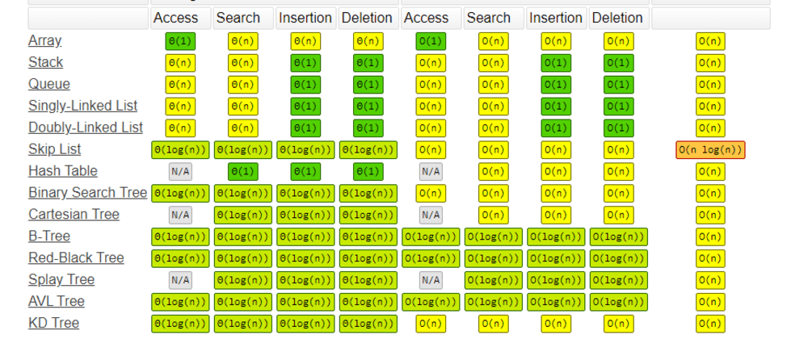
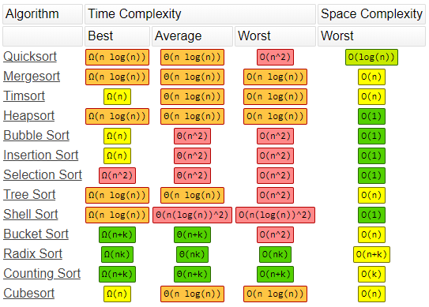

# Space and Time Complexity aka Big O

**What is good code?**  
Good code should have two different things that it can be described as:  

1. Readable - Can other people understand your code?
1. Scalable - Big O notation is what allows people to measure if code that is written is scalable

- Code is written by programmers, a set of instructions for the machine to use
- The machine takes that code (instructions) and runs through it
- There is an output based on the code (instructions) that the programmer has written

## Cheat Sheets

**Big O Cheat Sheet**  

**Sorting Cheat Sheet**

