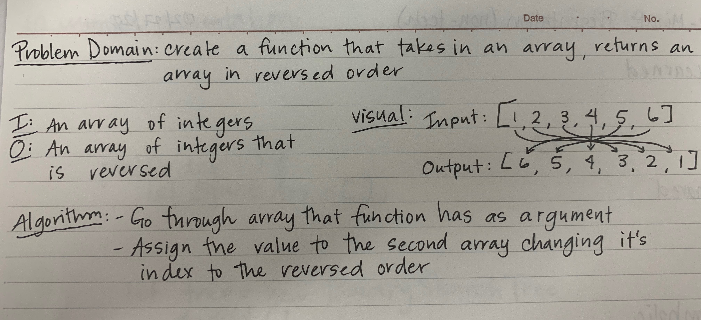
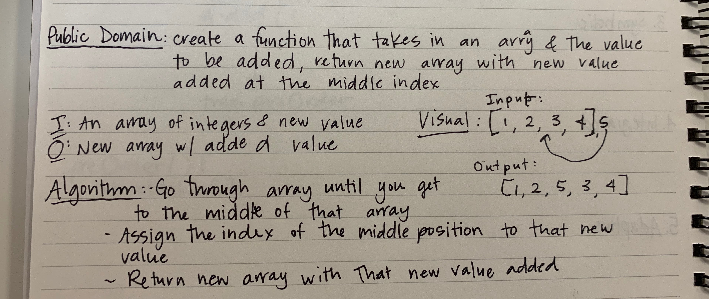
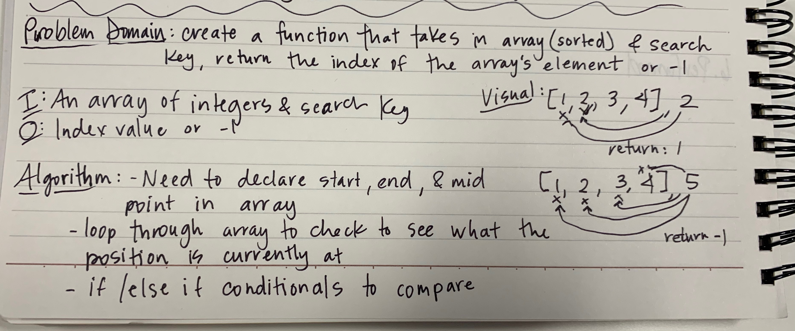

# Array Code Challenges

## ArrayReverse

### Challenge

- Create a function that takes in an array as an argument, without using built in methods, return an array with elements reversed

### Approach & Efficiency

- Create a new array that will be the length of the original array that was taken in as an argument
- Use a for loop to go through the original array, and in that loop re-assign the index to the new array
- Return the new array

### Solution 

## ArrayShift

### Challenge

- Create a function that takes in an array and a new value as an argument, without using built in method, return an array with new value added to the middle index

### Approach & Efficiency 

- Loop through the original array, until reaching the middle index of the array
- Using if conditionals assign the middle index to the new value, in the new array
- Return new array with that value added into the middle section

### Solution

## BinarySearch

### Challenge

- Create a function that takes in a sorted array and a search key. Return the index of the array's element that is the search key or return -1 if element is not in the array

### Approach & Efficiency 

- Need to declare a start, end and a midpoint of the array that function will be looking at 
- Loop through the array to check to see what the current position is currently at 
- Use if/else if conditionals to compare the all the elements for the search key

### Solution

## findMinimumValue

###

- Create a function that takes in an array, goe through the array and returns the minimum value of that array
