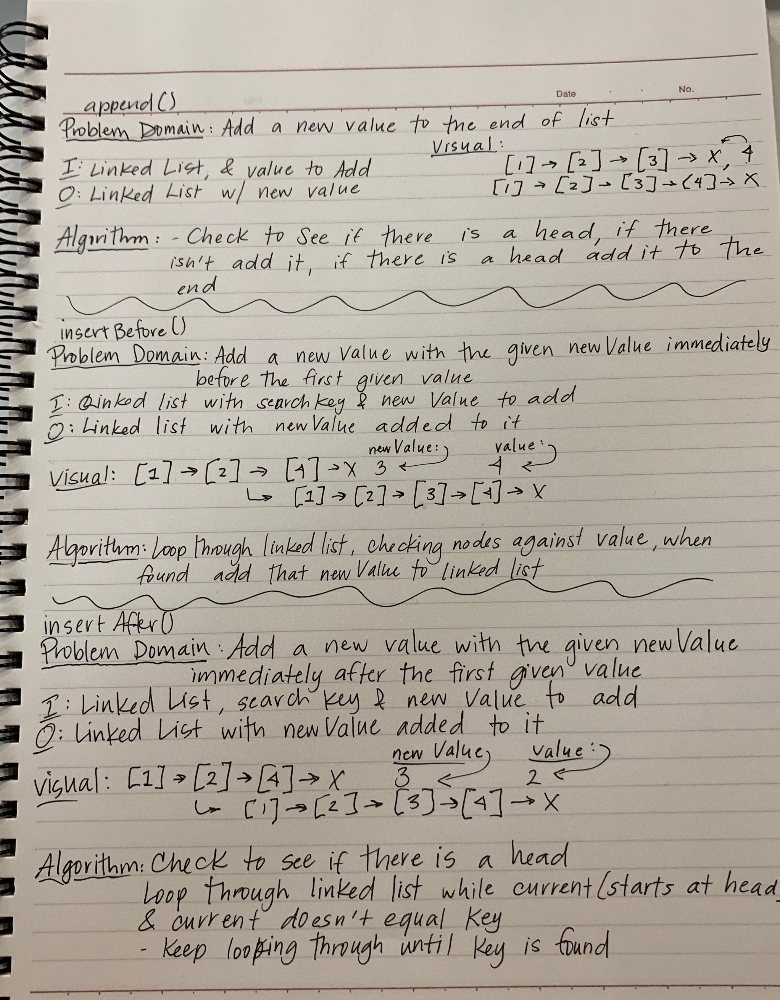

# Linked List Challenges

## Implementing a Linked List

### Challenge

Implementation of a Linked List with all of the methods that are listed down below under API

### API

**Insert()**  

Takes any value as an argument and adds a new node with the value to the head of the list with an O(1) Time performance

**Includes()**  

Takes any value as an argument and returns a boolean result depending on whether that value exists as a Node's value somewhere within the list

**toString()**  

Takes in no arguments and returns a string representing all the values in the Linked List, formatted as "{ a } -> { b } -> { c } -> NULL"

**append()**

Add a new value to the end of the list

**insertBefore()**

Add a new value to the linked list with the given newValue immediately before the first given value

**insertAfter()**

Add a new value to the linked list with the given newValue immediately after the first given value

### Whiteboard Images

**Whiteboard for append(), insertBefore(), and insertAfter()**

