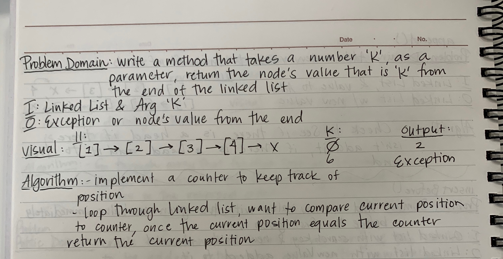
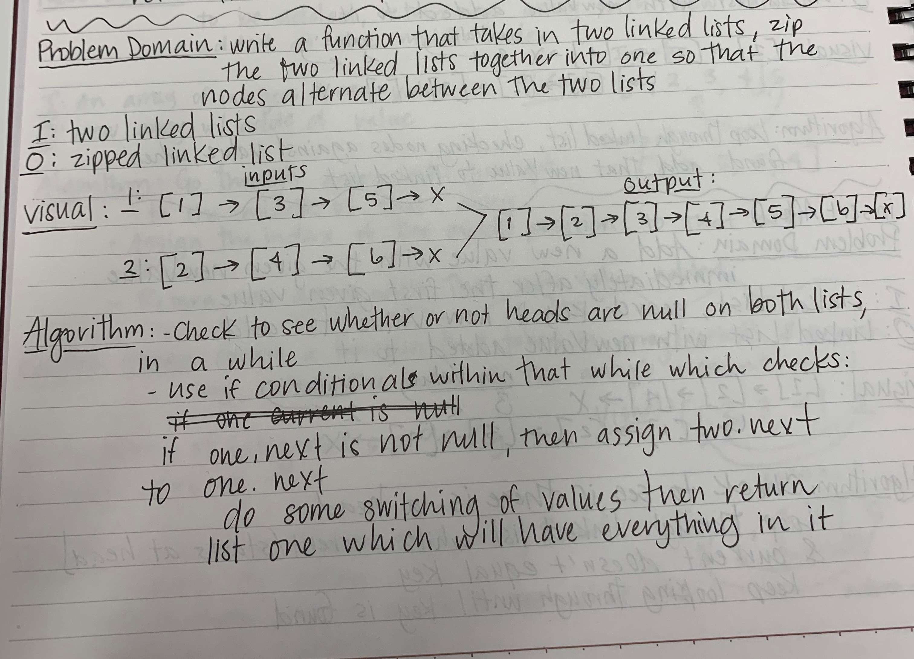

# Linked List Challenges

## Implementing a Linked List

### Challenge

Implementation of a Linked List with all of the methods that are listed down below under API

### API

**Insert()**  

Takes any value as an argument and adds a new node with the value to the head of the list with an O(1) Time performance

**Includes()**  

Takes any value as an argument and returns a boolean result depending on whether that value exists as a Node's value somewhere within the list

**toString()**  

Takes in no arguments and returns a string representing all the values in the Linked List, formatted as "{ a } -> { b } -> { c } -> NULL"

**append()**

Add a new value to the end of the list

**insertBefore()**

Add a new value to the linked list with the given newValue immediately before the first given value

**insertAfter()**

Add a new value to the linked list with the given newValue immediately after the first given value

**kthFromTheEnd()**

Create a method that takes a number 'k' as a parameter, return the node's value that is 'k' from the end of the linked list

**mergeLists()**

Takes in two linked lists, zip the two linked lists together into one so that the nodes alternate between the two lists

### Whiteboard Images

**Whiteboard for append(), insertBefore(), and insertAfter()**

**Whiteboard for kthFromTheEnd()**

**Whiteboard for the mergeList()**

## Other Challenges for Linked List

### Online Learning Project

- Main Class compares the differences (with notes added) between an ArrayList and a LinkedList
- Demo Class creates a vacation to Australia itinerary that is in alphabetic order with the ability to see where you are and what you previously visitied

### Online Challenge Project

- More information about this in the README which is located here: [onlineChallenge README](onlineChallenge/onlineChallenge.md)

